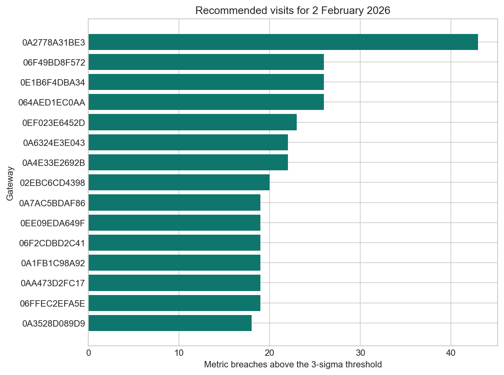
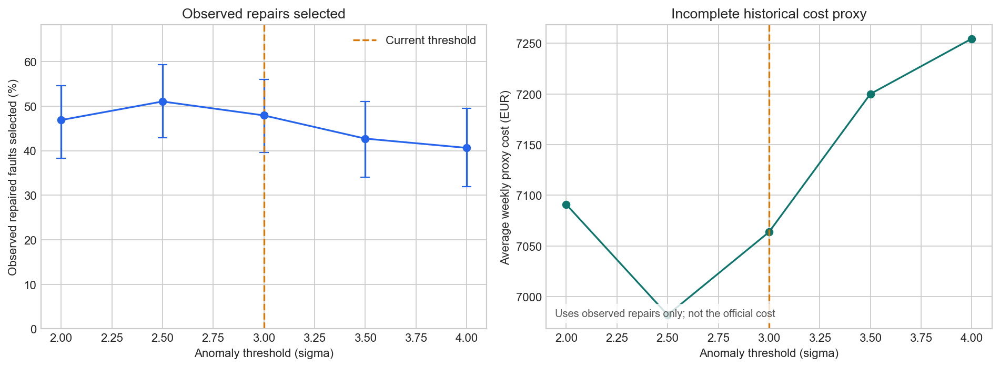
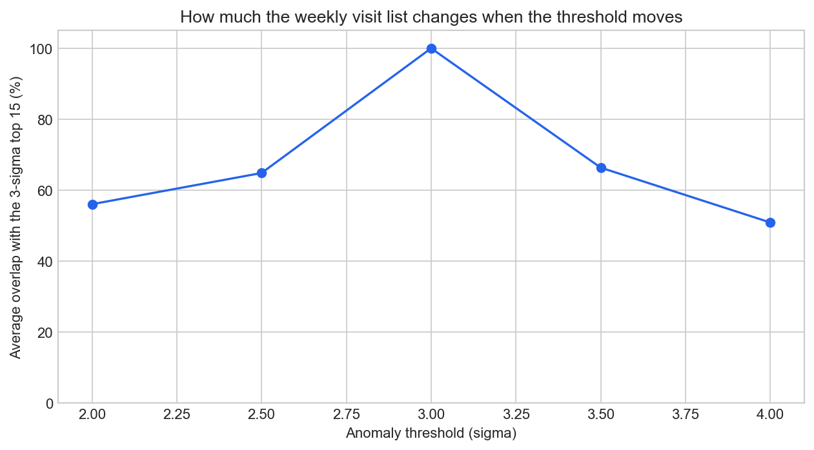
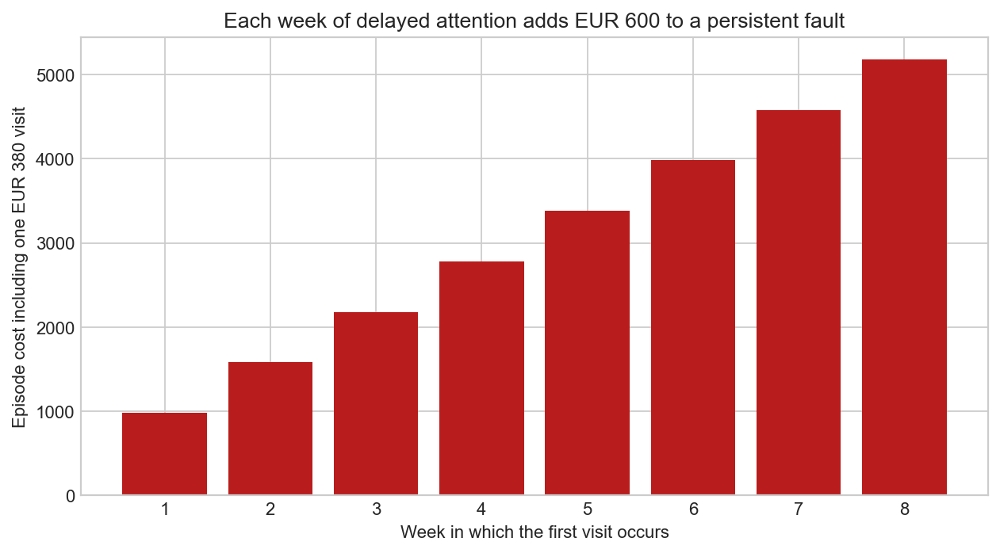

# LPDG Gateway Visit Ranking

This project ranks the 15 gateways that the field team should inspect each week. It uses only information available before the prediction Monday and writes the required 120-row `predictions.csv` for the eight weeks from 2 February to 23 March 2026.

## Chosen area

Part 2 area: **D - Data Science**.

The analysis defines what "needs a visit" means, compares anomaly thresholds, reports uncertainty from gateway-level resampling, and relates the result to the EUR 380 visit cost and EUR 600 weekly fault cost.

## Setup

Python 3.11 or later is recommended.

```powershell
python -m venv .venv
.venv\Scripts\Activate.ps1
python -m pip install -r requirements.txt
```

Place the supplied `data` directory at the project root. The data is confidential and is excluded from Git.

## Generate and validate the submission

```powershell
python run.py --data data --out predictions.csv
```

This command loads and cleans the inputs, generates all eight weekly rankings, writes `predictions.csv`, and runs the supplied format validator. A successful run ends with `Submission validation: OK`.

To validate an existing file independently:

```powershell
python validate_submission.py predictions.csv
```

## Run the Data Science analysis

```powershell
python analyse.py --data data
```

This writes `threshold_comparison.csv`, `cooldown_comparison.csv`, and four charts under `charts/`. On the development machine, prediction took about 8 seconds and the full historical analysis took about one minute.

## Visual results

### Recommended gateways for the first week



The chart shows the 15 gateways selected for 2 February 2026, ordered by the number of recent telemetry readings that crossed the three-sigma threshold. A larger count means the gateway showed unusual offline time, disconnections, or reboots more often during the previous seven days.

### Threshold evidence and cost



The left panel compares the percentage of observed repaired gateways captured at each threshold; its error bars show the 90% gateway-bootstrap range. The right panel compares an incomplete historical cost proxy. Although 2.5 sigma has the best point estimate, the evidence is limited and the uncertainty ranges overlap, so the final method retains the supplied three-sigma threshold.

### Stability of the weekly visit list



This chart measures how much each threshold's weekly top 15 overlaps with the selected three-sigma list. The 2.5-sigma result overlaps by about 65% on average, showing that a small threshold change would replace several weekly visits.

### Cost of detecting a persistent fault late



Under the supplied cost rule, dispatching a visit costs EUR 380 and each unresolved fault week costs EUR 600. The chart shows why earlier detection matters: every additional week before the first successful visit adds another EUR 600 to the fault episode.

## Run tests

```powershell
python -m pytest -q
```

The tests cover identifier cleaning, lifecycle filtering, strict time cutoffs, deterministic ties, silent gateways, and the supplied episode-cost rules.

## Method

For each Monday:

1. Keep gateways commissioned and not decommissioned at Monday 00:00 UTC.
2. Use telemetry strictly before that cutoff.
3. Estimate each gateway's mean and standard deviation over the previous 28 days.
4. Count metric readings in the previous seven days that exceed the gateway's own mean by more than three standard deviations.
5. Rank by metric-breach count, then missing recent hours, peak deviation, and gateway ID.
6. Return the first 15 with an operations-facing reason.

The three ranking metrics are `offline_duration_sec`, `disconnection_cnt`, and `reboot_cnt`. Exact duplicate gateway-timestamp records are removed once before scoring.

## Submission contents

| Requirement | Location |
| --- | --- |
| Validated 120-row output | `predictions.csv` |
| Code that produces the output | `run.py` and `gateway_ranker/` |
| Five decisions and chosen Part 2 area | `DECISIONS.md` |
| AI tool disclosure and one corrected issue | `AI-USAGE.md` |
| Data Science work | `analyse.py`, `analysis_report.md`, comparison CSV files, and `charts/` |
| Setup and run instructions | This README |
| Resume | Registration-ID-named PDF in the repository root, to be added before submission |
| Screen recording | Link in the section below |

The supplied dataset, challenge ZIP, brief, data dictionary, FAQs, and original bundle README are not committed. Reviewers should place the supplied `data` folder at the project root before running the code.

## Project structure

```text
gateway_ranker/
  config.py          thresholds, dates, costs and metrics
  data_loader.py     loading, validation, identifier and duplicate handling
  ranking.py         cutoff-safe scoring and top-15 selection
  evaluation.py      historical evidence, uncertainty and cost logic
  charts.py          report charts
tests/               small synthetic regression tests
run.py               submission entry point
analyse.py           Data Science analysis entry point
baseline_3sigma.py   supplied reference baseline
validate_submission.py supplied format validator
```

## Screen recording

Add the public, access-tested 6-8 minute recording link here before submission:

`[RECORDING LINK TO BE ADDED]`

The recording demonstrates setup, prediction generation and validation, and the main Data Science result.

## Important limitation

Historical field visits are a selected sample of already-suspected gateways. The reported evaluation measures agreement within that observed sample; it cannot establish fleet-wide precision, recall, or the official hidden-ground-truth cost. See `analysis_report.md` for the complete interpretation.
